# ZhongGuoGuShu (中国古术)
### High-Precision Chinese Metaphysics Computation, Cross-Verification & Full-Spectrum Inference Engine

[简体中文](README.md) | English

[](https://opensource.org/licenses/MIT)
[](https://www.python.org/downloads/)
[](https://modelcontextprotocol.io/)
[-success.svg)](file:///SHA256SUMS.txt)
[](file:///temp/run_all_assertions.py)

---

## 📖 Executive Summary

**ZhongGuoGuShu (中国古术)** is an open-source, strictly auditable, zero-drift computing engine and data foundation for traditional Chinese metaphysics (*Shushu*, 术数). 

Engineered with the rigor of modern astronomical software and cryptographic traceability, it unifies **15+ classical metaphysical schools**—including BaZi (Four Pillars), Ziwei Dou Shu, Da Liuren, Jinkoujue, Qimen Dunjia, Liuyao, Qizheng Siyu (Seven Governors & Four Extras), Tieban Shenshu, and more—under an immutable spatiotemporal coordinate system and **17 standardized MCP (Model Context Protocol) tools**.

### Core Tenet: *Discrepancy Has Nowhere to Hide (差异无处藏身)*
* **Zero Arbitrary Guesswork**: Every algorithm and calculation has a definitive classical bibliographic source (`source_ref`), strictly referenced to classical canons (*Ziping Zhenquan*, *Sanming Tonghui*, *Ditian Sui*, *Yuanhai Ziping*, *Ziwei Doushu Quanshu*, *Gu Lao Xing Zong*, *Da Liuren Daquan*, *Jinkoujue Daquan*, *Xieji Bianfang Shu*).
* **Transparent Conflict Adjudication**: All historical textual discrepancies, regional calendar variations, and school variants are registered in [`data/arbitration_log.csv`](data/arbitration_log.csv) and [`report/boundary_cases.csv`](report/boundary_cases.csv).
* **Cryptographic Code Integrity**: 215 repository files are strictly tracked by SHA-256 hashes normalized to LF line endings (`python l4_audit.py --verify`), preventing accidental drift or silent mutations.

---

## 🏛️ System Architecture

```mermaid
flowchart TD
    subgraph L0["Layer 0: Astronomical & Ephemeris Foundation"]
        S0["High-Precision Precompiled Tables (1948-2101)<br/>1,905 Lunations | 3,696 Solar Terms | Zero Disk I/O (1.7μs)"]
        S1["True Solar Time & Equation of Time (EOT)<br/>1986-1991 China DST Deductions | Southern Hemisphere Flipping"]
        S2["NASA JPL DE440 / Skyfield True Geometry Ephemeris"]
    end

    subgraph L1["Layer 1: Type-Safe Spatiotemporal Context"]
        CTX["ShushuContext & StandardPillars<br/>Immutable Sexagenary Coordinates (Year, Month, Day, Hour)"]
    end

    subgraph L2["Layer 2: Core Algorithmic Kernels"]
        B0["m1.py: Sexagenary Derivation & Ten Gods"]
        B1["l3_bazi_geju.py: Ziping Zhenquan Pattern Engine"]
        B2["l3_wangshuai.py: Elemental Strength Quantification"]
        B3["l3_shensha_ext.py: 50+ Classical Divine Stars"]
    end

    subgraph L3["Layer 3: 15+ Full-Spectrum Metaphysics Engines"]
        ZW["Ziwei Dou Shu & Flying Stars (l3_ziwei.py, l3_ziwei_yunxian.py)"]
        LR["Da Liuren & Jinkoujue (l3_liuren.py, l3_jinkoujue.py)"]
        QM["Qimen Dunjia Disc & Judgement (l3_qimen.py, l3_qimen_duanju.py)"]
        QZ["Qizheng Siyu 11 Heavenly Bodies (l3_qizheng.py)"]
        LY["Liuyao Najia & Hexagrams (l3_liuyao.py, l3_meihua.py)"]
        TB["Tieban & Shaozi Shenshu Rolling Wheel (l3_tieban.py, l3_tieban_ext.py)"]
        HL["Heluo Lishu & Huangli Almanac (l3_heluolishu.py, l3_huangli.py)"]
        HP["Synastry Hepan Multi-Pillars (l3_hepan.py, l3_bazi_liuri.py)"]
    end

    subgraph L4["Layer 4: Verification & MCP Services"]
        MCP["MCP Server: 16 Standardized Tools (mcp_server.py)"]
        AUD["L4 Cryptographic Audit (l4_audit.py: 215 Files LF-SHA256)"]
        REC["Automated Multi-Source Reconciliation & Anti-Hallucination Gate"]
    end

    L0 --> L1
    L1 --> L2
    L2 --> L3
    L3 --> L4
```



---

## 🌟 Key Innovations

### 1. In-Memory Zero-I/O Static Base (`data_static_tables.py`)
- **154-Year Precompiled Lookups (1948–2101)**: 1,905 exact lunation boundaries (*Shuo Wang*) and 3,696 high-precision solar terms (*Jie Qi*) precompiled directly into Python memory tables.
- **Microsecond Latency**: Pure in-memory bisection algorithm with **zero disk I/O**, achieving average lookup speeds of **1.77 microseconds per call**, completely immune to file descriptor exhaustion or SQLite table corruption.

### 2. Type-Safe Domain Model (`ShushuContext`)
- Replaces loose string passing with immutable, strongly typed dataclasses: `PillarInfo`, `StandardPillars`, and `ShushuContext`.
- Guarantees that all downstream calculations (Ziwei, Qimen, Liuren, Qizheng, etc.) operate on the exact same astronomical time coordinate and Sexagenary pillars, permanently eradicating inter-module pillar drift.

### 3. Comprehensive Astrological & Divinatory Coverage
* **BaZi Pattern Recognition (*Ziping Zhenquan*)**: Exact monthly commander (*Yueling*) residual qi scoring, hidden stem projection priority, Zheng Ba Ge, Jianlu, Yuejie, Yangren, Zhuanwang (5 dominant elemental forms), Cong (submissive patterns), and Huaqi (transformation patterns).
* **Da Liuren Jinkoujue (Golden Clasp Formula)**: 4-tier assembly (Ren Yuan, Gui Shen, Jiang Shen, Di Fen), Five Movements, Three Movements, Wang/Xiang/Xiu/Qiu/Si interactions, combined with classical punitive and clash relations.
* **Qizheng Siyu (Seven Governors & Four Extras)**: J2000 true celestial ecliptic longitudes, equatorial conversions, strict 180° Rahu/Ketu opposition, and the classical Ming dynasty unequal 28 Lunar Mansions (*Xiu Du*).
* **Ziwei Dou Shu & Yunxian**: Natal 12 palaces, Doujun annual rotation, Decade/Year/Month/Day/Hour flying stars, 9 Flowing Stars (Liu Lu, Liu Yang, Liu Tuo, Liu Kui, Liu Yue, Liu Chang, Liu Qu, Liu Hua), and flowing Four Transformations (*Sihua*).
* **Extended Shensha System (50+ Stars)**: Three Wonders (*San Qi*: Heavenly, Earthly, Human), Tai Ji, Tian She, Tian Yi, Shi E Da Bai, Yin Yang Cha Cuo, Gu Luan, Kuigang, and more.
* **Tieban Shenshu**: Classical 8-quarter wheel calculation (*Yi Shi Ba Ke*) and candidate verse verification loop.

---

## 🔌 16 Model Context Protocol (MCP) Tools

The system exposes 16 enterprise-grade MCP tools via standard JSON-RPC over stdin/stdout, allowing seamless integration with Claude Desktop, Cursor, Antigravity CLI, or any LLM agent framework.

| # | Tool Name | Description | Classical Canon / Basis |
|---|---|---|---|
| 1 | `shushu_bazi` | Four pillars, hidden stems, Na Yin, Ten Gods, Dayun, Liunian | *Sanming Tonghui*, *Ditian Sui* |
| 2 | `shushu_bazi_geju` | Pattern recognition (Regular, Yangren, Yuejie, Zhuanwang, Cong, Huaqi) | *Ziping Zhenquan* |
| 3 | `shushu_ziwei` | Natal chart, 12 palaces, main/auxiliary stars, star brightness, Sihua | *Ziwei Doushu Quanshu* |
| 4 | `shushu_ziwei_yunxian` | Doujun, Decades, Liunian/Liuyue/Liuri, 9 Flowing Stars, Flowing Sihua | Central Plains & Quanshu Schools |
| 5 | `shushu_liuren` | Da Liuren 4 classes, 3 transmissions, monthly general, 12 deities | *Da Liuren Daquan* |
| 6 | `shushu_jinkoujue` | Jinkoujue 4 levels (Ren Yuan, Gui Shen, Jiang Shen, Di Fen), 5 movements | *Da Liuren Jinkoujue Daquan* |
| 7 | `shushu_qimen` | Qimen Dunjia 72 bureaus, 9 stars, 8 gates, 8 deities, rotation disc | *Qimen Dunjia Tongzong* |
| 8 | `shushu_qizheng` | Seven Governors & Four Extras, J2000 longitudes, 28 Mansions | *Gu Lao Xing Zong* |
| 9 | `shushu_liuyao` | Six lines casting, Najia, Bagong, 6 relatives, 6 spiritual beasts | *Meihua Yishu*, *Jing Fang I Ching* |
| 10 | `shushu_shensha_ext` | 50+ classical auspicious & inauspicious divine stars | *Sanming Tonghui*, *Yuanhai Ziping* |
| 11 | `shushu_tieban_ext` | Tieban / Shaozi Shenshu 8-quarter wheel calculation & verse retrieval | *Shaozi Shenshu* |
| 12 | `shushu_huangli` | 12 Jianchu officers, Yellow & Black Dao, auspicious/inauspicious tasks | *Xieji Bianfang Shu* |
| 13 | `shushu_hepan` | Multi-person synastry, mutual Ten Gods, spouse palace interaction | Four canons synastry protocol |
| 14 | `shushu_heluo` | Heluo Lishu I Ching hexagram deduction via Taixuan numbers | *Heluo Lishu* |
| 15 | `shushu_meihua` | Plum Blossom divination, Prior Heaven numbers, Ti/Yong 5 dynamics | *Meihua Yishu* (Shao Yong) |
| 16 | `shushu_xiaoliuren` | Six palm quick divination (Da An, Liu Lian, Su Xi, Chi Kou, Xiao Ji, Kong Wang) | *Li Chunfeng Liu Ren Shi Ke* |

---

## 🚀 Quick Start

### Prerequisites
* Python 3.10 or higher
* Windows, Linux, or macOS

```bash
# Clone the repository
git clone https://github.com/natalieboswinkln606-png/zhongguogushu.git
cd zhongguogushu
```

### 1. Verify Cryptographic Integrity
Verify all 215 project files against the cryptographic baseline:
```bash
python l4_audit.py --verify
# Output: 快照校验通过：215 个文件哈希全部一致
```

### 2. Run All Automated Test Suites
Run the entire regression test battery (35 test suites, >1,300 assertions):
```bash
python temp/run_all_assertions.py
# Output: 全量回归断言汇总: 累计 PASS=1151+ | 累计 FAIL=0 | 最终判定: 【全部放行 ALL PASS】
```

### 3. Launching the MCP Server
To start the Model Context Protocol server over stdio:
```bash
python mcp_server.py
```

To run the built-in MCP diagnostic suite:
```bash
python mcp_server.py --test
# Output: 20/20 MCP TOOLS & CONTEXT INTEGRATION TESTS PASSED
```

### 4. Configuring Claude Desktop or Antigravity
Add the following to your `claude_desktop_config.json`:
```json
{
  "mcpServers": {
    "zhongguogushu": {
      "command": "python",
      "args": ["D:/shushu/mcp_server.py"]
    }
  }
}
```

---

## 📊 Verification & Benchmarking

The repository enforces strict continuous verification:
1. **Astronomy & Calendar Anchors**:
   - Contemporary (1900–2100): Purple Mountain Observatory / Hong Kong Observatory minute-level alignment.
   - Ancient (pre-1900): Dr. Zhang Peiyu's *3,500 Years of Calendar and Celestial Phenomena* (三千五百年历日天象).
   - Skyfield / NASA JPL DE440s cross-checked to within ≤2 arcminutes.
2. **Double-Source Reconciliation**:
   - Automated discrepancy detectors compare every generated chart with independent web oracles (`lunar-python`, Yianju, etc.).
   - Discrepancies are systematically registered in [`data/arbitration_log.csv`](data/arbitration_log.csv).
3. **Anti-Hallucination Reconciler**:
   - `l4_audit_output.py` and `l5_defense_check.py` parse generated markdown reports, asserting that every single date, star, deity, and line mentioned in natural language text exactly matches the underlying cryptographic snapshot.

---

## 📚 Classical Canon Bibliography

| Abbreviation | Classical Source | Dynastic Era / Author | Core Application |
|---|---|---|---|
| **ZPZQ** | 《子平真诠》 | Qing Dynasty / Shen Xiaozhan | BaZi Monthly Commander & Pattern Recognition |
| **SMTH** | 《三命通会》 | Ming Dynasty / Wan Minying | Four Pillars, Ten Gods, Classical Shensha |
| **DTS** | 《滴天髓》 | Song/Ming / Jinghe, Liu Bowen | Dynamic Elemental Balance, Flow & Clashes |
| **ZWQS** | 《紫微斗数全书》 | Ming Dynasty / Chen Tuan, Luo Hongxian | Ziwei Charting, Palaces, Brightness, Sihua |
| **LRDQ** | 《大六壬大全》 | Ming Dynasty / Guo Zaiyu | 9 Clashing Gates, 3 Transmissions, 4 Classes |
| **JKJ** | 《大六壬金口诀大全》 | Song/Ming Tradition | 4-Level Divine Divination & Five Movements |
| **GLXZ** | 《果老星宗》 | Tang/Ming Tradition / Zhang Guo | Seven Governors & Four Extras Astrological Charting |
| **QMDC** | 《奇门遁甲统宗》 | Ming/Qing Tradition | Chai Bu 72 Bureau Rotation & Deity Placement |
| **MHYS** | 《梅花易数》 | Song Dynasty / Shao Yong | Prior Heaven Numbers, Ti/Yong Interaction |
| **XJBF** | 《协纪辨方书》 | Qing Dynasty / Imperial Commission | Almanac, 12 Jianchu Officers, Auspicious Days |
| **SZSS** | 《邵子神数》 / 《铁板神数》 | Song/Qing Tradition | Rolling Wheel 8-Quarter Verse Indexing |

---

## 📄 License

This project is open source and available under the [MIT License](LICENSE).
