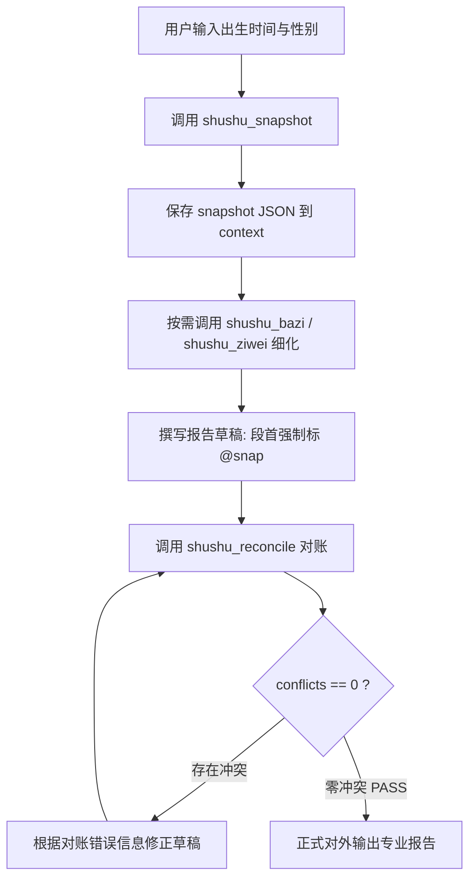

# 中国传统术数 AI Agent 官方技能指南 (shushu)

本指南是 AI Agent（包括 Claude、Gemini、Antigravity 等）在进行中国传统术数（四柱八字、紫微斗数、时家奇门、六爻纳甲、人际合盘、称骨、神煞等）咨询、分析与报告生成时的**最高操作准则**。

---

## 1. 核心铁律（四条不可逾越的红线）

历史实践表明，大语言模型在推算干支序列、六十甲子逆排、星曜落宫及复杂数理时极易产生严重幻觉。系统确立以下四条铁律：

### 铁律 1【严禁手推（No Mental Calculation）】
- **严禁凭记忆或通用知识手推**任何确定性数据（包括但不限于：四柱干支、节气换月、藏干十神、顺逆大运步骤与年份区间、流年干支、神煞列表、旺衰分值、紫微星曜落宫与三方四正、奇门九宫星门神、六爻卦象爻辞与纳甲六亲）。
- **所有数据必须由引擎 Tool 直出**。AI 只能在引擎返回的 JSON Facts 基础上进行义理阐发、格局取象与综合建议，严禁在推理过程中凭直觉填补任何干支数据。

### 铁律 2【强制段首 @snap 溯源引用】
- 在起草测算报告时，凡包含测算数据的分析段落，**段首必须显式标注 `@snap...` 引用标签**。
- 引用示例：
  * `@snap pillars: 丙戌/甲午/乙酉/丙子 | day_master=乙`
  * `@snap dayun: 癸巳(2012-2021) 壬辰(2022-2031) 辛卯(2032-2041)`
  * `@snap wangshuai: score=24.2 level=极弱 advice=喜印比生扶`
  * `@snap ziwei.sanfang_sizheng: scope=[夫妻,福德,迁移,官禄] 夫妻宫=天同`
  * `@snap qimen: dingju=夏至阴遁3局中元 zhifu_star=天心 zhishi_door=开门`
  * `@snap liuyao: ben_gua=水山蹇 bian_gua=地山谦 dong=初爻`

### 铁律 3【出口前强制 shushu_reconcile 对账清零】
- 在正式将任何结论或报告输出给用户前，**必须调用 `shushu_reconcile(draft_text, snapshot_json)` 进行机械化对账**。
- **门禁条件**：`conflicts == 0` 且 `verdict == 'PASS'`。
- 若存在任一 `conflict`（如十神错位、大运错步、旺衰分值漂移、年龄流年算错），**绝对禁止对外输出**！必须立刻根据对账返回的 diff 进行修改，直至清零。

### 铁律 4【双源同引一致性】
- 同一事实在草稿全文多处出现时（如八步大运年份、日主十神、生肖纳音），必须严格引自同一份快照，全文完全一致。严禁章节之间前后矛盾或套用旧命造模板。

---

## 2. MCP Tools 快速参考表

MCP Server (`mcp_server.py`) 提供了 16 个官方标准 Tools：

| 工具名称 | 输入参数 | 核心输出内容 | 适用场景 |
| :--- | :--- | :--- | :--- |
| `shushu_snapshot` | `datetime_str`, `gender="男"`, `longitude=120.0` | 端到端全量 Facts（16大术种直出全景 JSON，绑定 SHA256 引擎版本） | 命盘初始化、对账基准源、归档证据链 |
| `shushu_bazi` | `datetime_str`, `longitude=120.0`, `gender="男"` | 四柱干支、各柱十神与藏干、顺逆8步大运、旺衰三得评分、23项主流神煞 | 八字命理详批、大运起运、五行喜忌 |
| `shushu_ziwei` | `datetime_str`, `longitude=120.0`, `gender="男"` | 命身宫、五行局、十二宫星曜（主星/吉辅/六煞分栏）、生年四化、各宫三方四正合宫星系 | 紫微斗数排盘、格局分析、三方四正会照 |
| `shushu_qimen` | `datetime_str`, `longitude=120.0` | 拆补定局（局数/三元）、转盘九宫星门神仪排布、旬首符使、四纲用神落宫、格局清单与吉凶倾向 | 奇门占事、行止择吉、局势研判 |
| `shushu_liuyao` | `time_str=None`, `num1=None`, `num2=None`, `hour_num=None` | 本卦变卦、六爻动静、京房八宫六亲、日干起六神、增删卜易世应、月建日辰生克冲合 | 专项卜卦（求财/合作/问病/出行等） |
| `shushu_hepan` | `dt1`, `gender1`, `lon1`, `dt2`, `gender2`, `lon2` | 天干五合克、地支冲合刑害、夫妻宫日支互动、生肖纳音匹配、五行互补、流年太岁引动 | 两人合婚、合伙人匹配、人际相处 |
| `shushu_reconcile`| `draft_text`, `snapshot_json` | 文本 ↔ 快照严格机械对比：抓出序列错位(`shifted`)、冒充大运(`not_in_dayun`)、双源冲突、旺衰漂移(`ws_score_drift`)、十神错配(`ten_god_mismatch`)、年龄换算错误(`age_year_mismatch`) | **出口前必须调用的第一道与最后一道防线** |
| `shushu_bazi_geju`| `dt=None`, `four_pillars=None`, `gender="男"`, `lon=120.0` | 八字格局自动判定（正八格、专旺从强格、从弱格、化气格、禄刃格），输出结构化判定证据链 | 八字定格、喜忌格局判定 |
| `shushu_jieqi_query`| `year`, `term_name=None` | 历法原语：二十四节气精确时刻秒级查询（基于高精静态历表，零 I/O） | 节气换月边界排查、立春时刻定位 |
| `shushu_calendar_convert`| `solar_date=None`, `lunar_year=None`, `lunar_month=None`, `lunar_day=None`, `is_leap=False` | 历法原语：公历与农历双向精准互转，支持闰月与干支反查（静态只读零 I/O） | 生日公农历换算、闰月确认 |
| `shushu_timezone`| `wall_time`, `tz_name="Asia/Shanghai"`, `lon=120.0`, `lat=35.0`, `school="astronomical"` | 全球时区、夏令时（中国1986-1991自动回退）、经度+均时差真太阳时、南半球派系A/B路由 | 海外出生排盘、夏令时纠正、南半球八字 |
| `shushu_jinkoujue`| `datetime_str=None`, `difen="卯"`, `day_gan=None`, `hour_zhi=None`, `month_jiang_zhi=None` | 大六壬金口诀推命排盘：四位（人元/贵神/将神/地分）、五动克应、三动克应、旺相休囚死与刑冲克害 | 金口诀实占、问事吉凶、三动五动分析 |
| `shushu_qizheng`| `datetime_str`, `longitude=120.0`, `latitude=35.0`, `tz_name="Asia/Shanghai"` | 果老星宗七政四余（十一曜）真视黄经、黄道十二宫度数、二十八宿 IAU J2000 真黄经入宿度 | 七政四余天星盘、星盘宿度测算 |
| `shushu_ziwei_yunxian`| `datetime_str`, `target_year`, `target_lunar_month=1`, `target_lunar_day=1`, `target_hour_zhi="子"` | 紫微斗数多级运限：流年斗君起正月、流月/流日/流时命宫、流年九大流曜飞星与流年四化 | 流年运程详批、流月流日细断 |
| `shushu_shensha_ext`| `datetime_str=None`, `four_pillars=None`, `lunar_month=None`, `gender="男"` | 50+ 扩展商业与经典神煞：三奇贵人紧贴判定、太极、天赦、天医、十恶大败、阴阳差错、孤鸾煞、金神等 | 命理全谱神煞检索与吉凶格局补正 |
| `shushu_tieban`| `datetime_str=None`, `four_pillars=None`, `ke=1`, `longitude=120.0` | 邵子神数 / 铁板神数算盘八刻滚盘取数：四柱太玄数、考八刻分、考父母配偶兄弟功名寿元定数条文检索 | 铁板神数考刻分、条文数理推导 |

---

## 3. 标准操作工作流（Workflows）

### 工作流 A：八字/紫微/综合命理咨询标准流



#### 实施步骤：
1. **获取快照**：
   ```json
   // 工具调用
   shushu_snapshot({
     "datetime_str": "2006-06-25 00:30",
     "gender": "女",
     "longitude": 120.0
   })
   ```
2. **提取并牢记关键 Facts**：
   - 四柱：`pillars`（年柱、月柱、日柱、时柱）。
   - 日主：`day_master`（如 "乙"）。
   - 大运：第一步干支必须等于 `dayun.steps[0].ganzhi`，年份区间必须等于 `start_year - end_year`。
   - 旺衰：综合得分 `wangshuai.zonghe.score`（如 24.2分，偏弱/极弱），严禁改动分值。
   - 紫微三方四正：引用宫位必须严格对照 `c_six_key_palace_sanfang_sizheng[宫位].scope_palaces`。
3. **编写草稿**：
   - 凡涉及年份、干支、十神、分数处，段首打上 `@snap`。
4. **对账清零**：
   ```json
   shushu_reconcile({
     "draft_text": "...报告草稿全文...",
     "snapshot_json": "<前述 snapshot 返回结果>"
   })
   ```
5. **确认结果**：
   - 确保 `verdict: "PASS"` 且 `conflicts: []`。

---

### 工作流 B：时家奇门决策流

1. **起局**：
   调用 `shushu_qimen(datetime_str="2026-09-16 10:00", longitude=120.0)`。
2. **分析要素提取**：
   - **定局信息**：看 `dingju.term`（节气）、`dun`（阳遁/阴遁）、`ju`（几局）。
   - **旬首与符使**：查看 `zhifu_zhishi`，明确值符星落何宫、值使门落何宫。
   - **用神落宫**：日干代表求测人，时干代表事体，值符代表主事领导，值使代表执行落实。
   - **格局与吉凶**：查看 `duanju.geju` 命中清单（吉格/凶格），重点核对 `duanju.chubu.xiong_palaces`（门迫、击刑、入墓宫位）。
3. **输出要求**：明确引用九宫星门神仪坐标，严禁在中五宫写死门或值符（中五宫寄坤二宫）。

---

### 工作流 C：六爻卜筮流

1. **起卦**：
   - 若用户提供报数（如报数 3 与 5）：调用 `shushu_liuyao(num1=3, num2=5, hour_num=6)`。
   - 若按当前时间起卦：调用 `shushu_liuyao()`。
2. **卦象分析**：
   - 本卦与变卦卦名、八宫卦序。
   - 确定世爻与应爻位置（`shi_pos`, `ying_pos`）。
   - 六亲五行与月建日辰生克冲合关系（旺衰辅助）。
   - 动爻动静变化与化出之爻。
3. **对齐契约**：严格遵守六爻止于排卦与生克关系列示，取象分析围绕所问事体展开，不可无中生有。

---

### 工作流 D：两人合盘互动流

1. **双盘计算**：
   调用 `shushu_hepan(dt1="...", gender1="男", lon1=120.0, dt2="...", gender2="女", lon2=120.0)`。
2. **合盘五维核对**：
   - 天干关系：`hp-01`（天干五合、相克）。
   - 地支关系：`hp-02`（六合、六冲、三刑、六害）。
   - 核心柱位：`hp-03` 中的夫妻宫（日支）关系、生肖（年支）互动、年柱纳音生克。
   - 结构评分：`hp-04` 总评分与场景倾向（婚姻/合作/朋友/相处）。
   - 流年太岁引动：`hp-05` 目标年份的冲合刑害。

---

## 4. 警钟长鸣：五大经典历史事故与防范案例

在过去的实测案例中，曾发生过以下典型手推硬伤，AI 必须深刻吸取教训，坚决杜绝：

| 事故类型 | 历史真实错误案例（反面教材） | 引擎实证正确答案 | 根因与防范机制 |
| :--- | :--- | :--- | :--- |
| **大运错位** | 2006-06-25 女命大运被凭记忆手推错位一位：误写为“甲午(2012-2021)→癸巳(2022-2031)…” | 丙戌阳年女逆排，第一步为月柱甲午上一位：**癸巳(2012-2021)→壬辰(2022-2031)** | 凭印象手排。必须调用 `shushu_bazi`，大运首步与月柱严格相差±1，`reconcile` 规则二自动拦截。 |
| **奇门双写** | 转录时把值符天芮与死门**同时写在中五宫和艮八宫** | 中五宫寄坤二宫，中五宫 star/door/shen 全为 None，**仅落艮八宫一处** | 凭印象抄写。奇门九宫必须严格遍历 `pan` 字段，中五宫无星门神。 |
| **称骨全错** | 称骨四柱凭记忆手写，将年柱乙酉错写为丙戌、月柱九月错写为甲午，骨重全错 | 年=乙酉(1两5钱)、月=九月(1两8钱)、日=22日(9钱)、时=酉时(9钱)，合计5两1钱 | 凭直觉手工心算。必须由 `shushu_snapshot.chenggu` 直出。 |
| **紫微星跨宫误植** | 凭“星耀多显专业”直觉，将疾厄宫的天钺、父母宫的陀罗误植入命宫 | 命宫星曜严格为天相+文昌+文曲，无天钺陀罗 | 未对照快照。十二宫星曜必须从 `shushu_ziwei.palaces` 逐宫引用。 |
| **旺衰分数漂移** | 算完正确分值后未清理旧文本残留，前文写 24.2分极弱，后文残留“55.8分中和” | 快照综合分 `ws_score` 全文唯一 | 盲点 A。`reconcile` 规则五自动扫描全文所有带档位的“X分”，偏差 >0.5 立即报错。 |
| **藏干十神错配** | 日主辛金，月支戌藏干十神误写为“戊偏财/辛七杀/丁食神” | 日主辛，戊为正印、辛为比肩、丁为七杀 | 盲点 B。`reconcile` 规则六扫描天干与十神映射，不符 `DM_GOD` 立即报错。 |
| **流年年龄算错** | 文中写“20岁 2025 转折 流年比肩”（实际出生2005年，2025应为20岁但干支为乙巳偏财） | 年份与岁数换算必须满足 `YYYY - birth_year == age ± 1` | 盲点 C。`reconcile` 规则七强制流年与年龄对齐。 |

---

## 5. 对账拦截（shushu_reconcile）典型报错应对指南

当调用 `shushu_reconcile` 出现 conflicts 时，按以下指引排查：

1. **`shifted`（大运年份错位）**：
   - 报错：`"癸巳 实为大运第1步(2012-2021)，文中写作 (2022-2031)"`
   - 处理：立刻检查大运排盘，将文中年份区间修改为快照中的真实起止年份。
2. **`not_in_dayun`（冒名大运）**：
   - 报错：`"甲午 不在本命大运序列，文中却配十年区间 (2012-2021) 冒充大运步骤"`
   - 处理：删除该伪造的大运步骤，更正为真正的大运干支。
3. **`double_source_mismatch`（双源不一致）**：
   - 报错：`"大运XX在文中出现多处，年份/十神不一致"`
   - 处理：全文检索该干支，将所有副出现处的年份、十神全部统一为快照值，或改为“见前述大运表”引用。
4. **`ws_score_drift`（旺衰分值漂移）**：
   - 报错：`"文中出现 55.8 分中和，快照实际为 24.2 分（极弱）"`
   - 处理：全文替换所有分数字面，清除草稿中复用模板的残留旧分值。
5. **`ten_god_mismatch`（十神配对错误）**：
   - 报错：`"日主辛对应戊应为正印，文中写偏财"`
   - 处理：更正十神字面，严格以日元为坐标查对十神。
6. **`age_year_mismatch`（年龄年份脱节）**：
   - 报错：`"文中写20岁2031年，但 2031-2005=26岁"`
   - 处理：使用公历出生年份重新核算虚实岁数。

---

## 6. 结语

传统术数之美在于数理严密与象数相谐。作为 AI Agent，唯有恪守**“计算归引擎、推理赋灵性、审计守门禁”**的分工原则，才能为用户提供精准、负责、可靠的学术级专业命理咨询服务。
